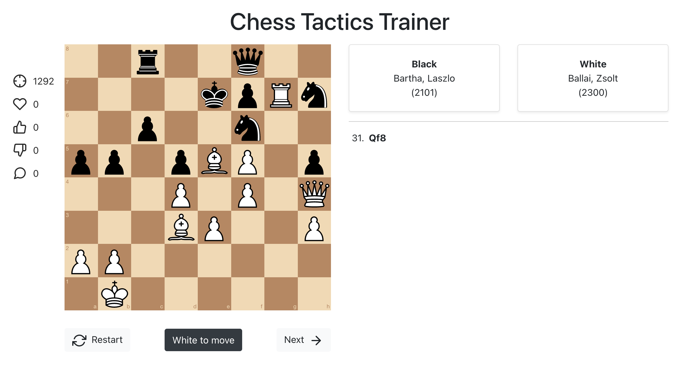

# Chess Tactics Trainer

Practice your chess skills by playing random chess puzzles.

This app was made using the following projects:
* [ChessboardJSX](https://github.com/willb335/chessboardjsx) to display the chess board & pieces
* [chess.js](https://github.com/jhlywa/chess.js) for chess move generation/validation, piece placement/movement, and check/checkmate/stalemate detection - basically everything but the AI.
* [Chess Blunders API](https://chessblunders.org/api) to fetch random chess puzzles, along with game & player informations

This project was bootstrapped with [Create React App](https://github.com/facebook/create-react-app).

## UI
The UI shows informations about the current puzzle on the left, fetched from Chess Blunders API:
* Rank
* Number of favs
* Number of likes
* Number of dislikes
* Number of comments

On the right there are informations (if available) about the actual game from which came the puzzle: who played black and who played white (name + rank). There is also the history of moves made in the game.

## Features
* Play current puzzle until you solve it - _Note: you can only make a certain move each time, the good one 👌_
* Restart current puzzle
* Go to next puzzle

## Roadmap
- [ ] Github Pages hosting + CI/CD
- [ ] Hint button
- [ ] Timer
- [ ] Scoring system

## Licence

Creative Commons License
This work is licensed under a [Creative Commons Attribution-NonCommercial-ShareAlike 4.0 International License](https://creativecommons.org/licenses/by-nc-sa/4.0/).